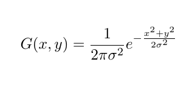
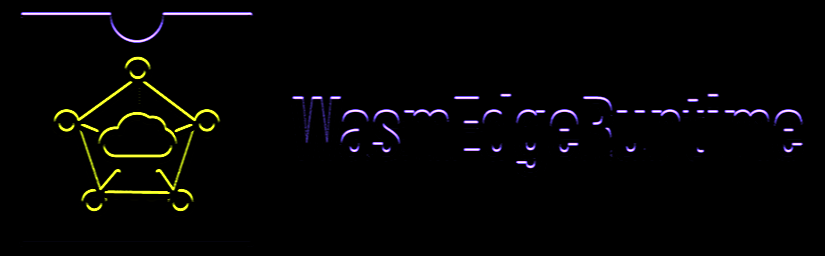
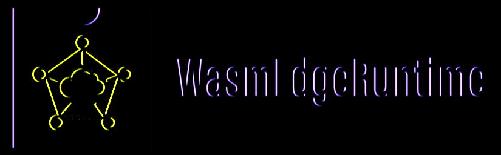
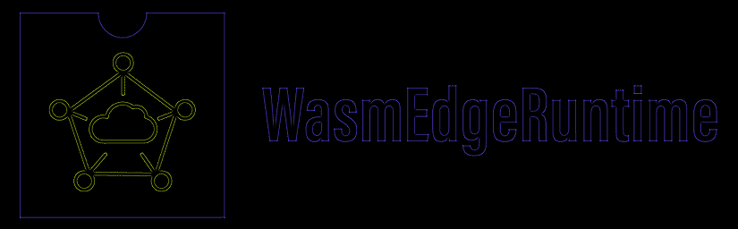

# OpenCV Filtering

## Build instructions & Usage

```
mkdir build 
cd build
cmake .. [-GNinja]
make [or ninja]
./filtering [image file path]
```

### How it is implemented?

1. First the filter to be applied is chosen from the following options
    - Box filter
    - Gaussian filter
    - Sobel Edge-Y filter
    - Sobel Edge-X filter
    - Sharpen filter
    - High Pass filter
    - Emboss filter

2. Then the filtering, i.e., the convolution, is then applied to the source image, in the following way :-
    - For the **box filter**, the function
        ```
        cv::boxFilter(src, dst, ddepth, ksize)
        ```
        is used, where, \
        `src` - source image \
        `dst` - destination image \
        `ddepth`  - depth of the image, -1 means the source image's depth will be used \ 
        `ksize` - dimensions (size) of the kernel \

    - For the **Gaussian blur** filter, the function
        ```
        cv::GaussianBlur(src, dst, dims, sigmaX);
        ```
        is used, where, \
        `src` - source image \
        `dst` - destination image \
        `ksize` - dimensions (size) of the kernel \
        `sigmaX` - Gaussian kernel's standard deviation in X direction, O implies it will be calculated from the kernel's size \

        Reference: \
        $\sigma$ = standard deviation \
        
    
    - For the **Sobel Y and X filters**, the function
        ```
        cv::Sobel(src, dst, ddepth, dx, dy, ksize);
        ```
        is used, where, \
        `src` - source image \
        `dst` - destination image \
        `ddepth`  - depth of the image, -1 means the source image's depth will be used \ 
        `dx` - order of x-derivative \
        `dy` - order of y-derivative \
        `ksize` - dimensions (size) of the kernel 

        If (dx, dy) = (0, 1), then the Sobel Y filter is applied \
        If (dx, dy) = (1, 0), then the Sobel X filter is applied

    - For the **sharpen, high-pass and emboss filters**, the pre-baked kernels are used, in the function
        ```
        cv::filter2D(src, dst, ddepth, kernel)
        ```
        where, \
        `src` - source image \
        `dst` - destination image \
        `ddepth` - depth of the image, -1 means the source image's depth will be used  
        `kernel` - the kernel, which is convolved over the image

### Output

1. **Box filter**: A simple blur filter

| Original | Output |
| -------- | ------ |
|  |  |

2. **Gaussian filter**: A noise-free blur filter

| Original | Output |
| -------- | ------ |
|  |  |

3. **Sobel Edge-Y filter**: Detects vertical edges 

| Original | Output |
| -------- | ------ |
|  |  |

4. **Sobel Edge-X filter**: Detects horizontal edges

| Original | Output |
| -------- | ------ |
|  |  |

5. **Sharpen filter**: Sharpens the image

| Original | Output |
| -------- | ------ |
|  |  |

6. **High Pass filter**: Shows the edges

| Original | Output |
| -------- | ------ |
|  |  |

7. **Emboss filter**: Gives a shadow background look

| Original | Output |
| -------- | ------ |
|  |  |

